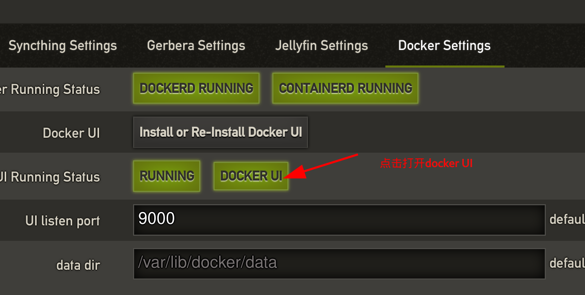
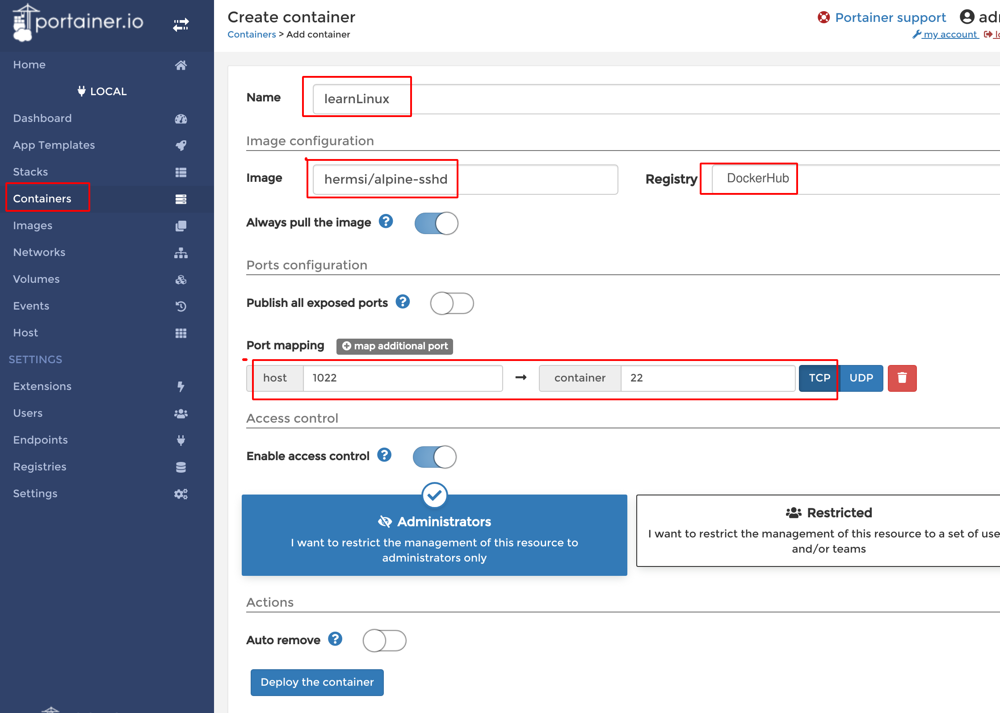
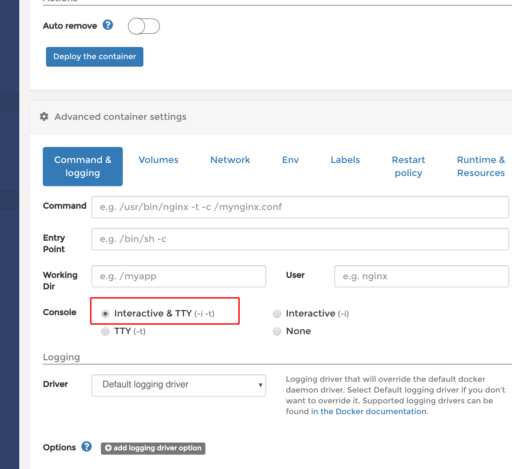
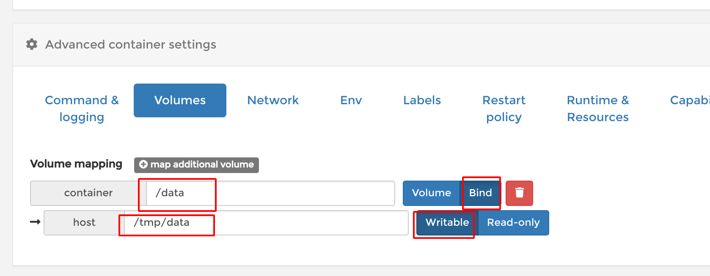
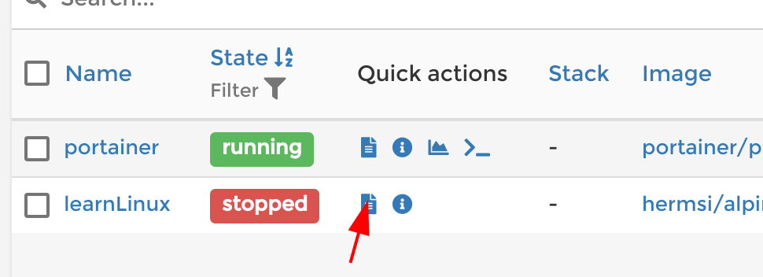
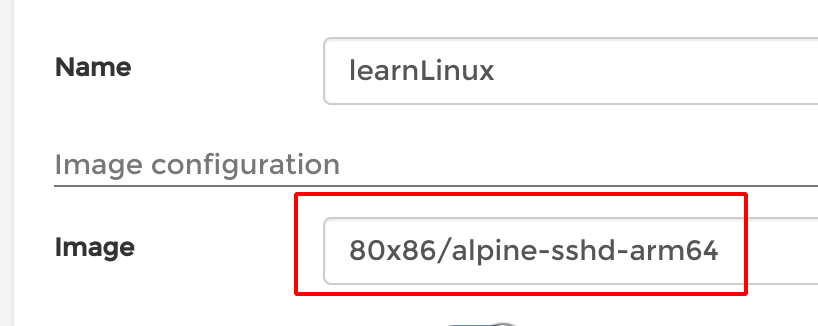
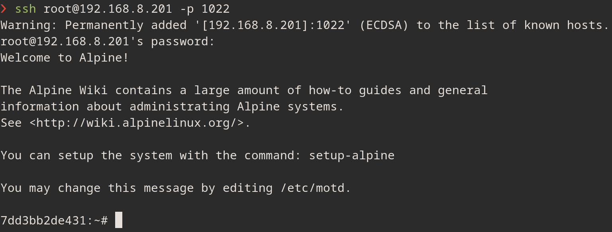
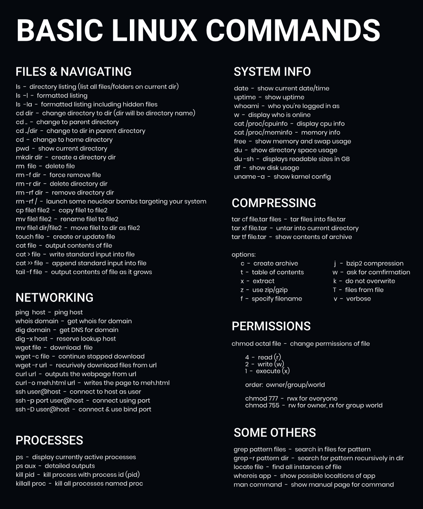

注：此文章为NanoDM站点建立之后从老灯的微信公众号用[pandoc](https://pandoc.org/MANUAL.html)导出生成:
```bash
pandoc -f html -t markdown_github-raw_html-native_divs-native_spans nanodm-docker-play-minimal-image
```

--------------------------------------------------

@author: 荒野无灯

@date:  Friday, March 29, 2019  

--------------------------------------------------

  

本文涉及知识点：

1.从docker UI工具创建容器，映射端口和目录

2.遇到exec user process caused "exec format error"错误时如何解决
(这是很多用N1玩docker的朋友经常遇到的问题：为啥我的操作没任何问题，它就是跑不了，真是气人啊)

3.从ssh客户端（如putty和xshell等）连接到docker容器

  

首先，镜像方面，我们为了快速地玩耍，肯定不会选ubuntu这种比较笨重的。

alpine linux天生就是给docker用的（最小镜像只有5M左右）。

但是官方的最小镜像默认是没有ssh的，因此可能操作起来没那么方便。

所以，这里老灯找了一个比官方多一个sshd的镜像：

<https://hub.docker.com/r/hermsi/alpine-sshd/dockerfile>

pull 数量有1M+，应该算是比较高票的。



切换到container, 我们新建一个容器：

取一个有意义的名字：learnLinux        

Image 处我们填写： hermsi/alpine-sshd

然后，Registry 就用默认的dockerhub

Port mapping 即端口映射，我们这里将本机的**1022**
端口映射到了容器里的**22**端口. 协议类型默认选的是**TCP**.



先别着急点 **Deploy the container**， 我们先设置一下高级选项：

我们勾选一下Console里的 **Interactive & TTY** ,
这个就是经常在网上能看到的 docker run -it .... 里的 -it 选项了：

  



  

然后我们映射一个数据目录给容器使用。

因为容器本身，按习惯来说，是不应该在容器本身里修改数据的。因此，保存数据的目录，我们都是映射到外部的host主机的。

默认是volume方式，这里为了方便，我们选择bind方式，然后填写容器里的目录：
/data

host那里填写： /tmp/data

因为我们是测试和学习，里面的东西并不想真正保存，因此这个目录，我们设立在/tmp下面。

像下图这样设置，我们在容器里访问 /data
就实际访问的是host机的/tmp/data了：



最后，我们勾选 Deploy the container 开始发布容器.

由于这个镜像真的是很小很小，因此，大概几秒钟之后，容器就OK了，然后我们可以看到它是运行状态：


别高兴太早，没过一会，就会发现这个容器停止运行了。我们点击查看一下log:



然后发现如下错误：


```
standard_init_linux.go:207: exec user process caused "exec format error"
```


没错，这是用arm64机器玩docker,遇到的最常见的一个错误.

这个镜像默认是针对x86平台构架的。因此报了这个exec format error错。

我们去看看alpine官方镜像： <https://hub.docker.com/_/alpine>

右侧显示，这个镜像是支持多种CPU架构的，ARM64也在列表中。

然后我们看左边的description下面有： Supported architectures


我们点击arm64v8,就可以到 <https://hub.docker.com/r/arm64v8/alpine/>

然后，可以看到：Supported tags and respective Dockerfile links 有：

[`20190228`, `edge` (*aarch64//Dockerfile*)](https://github.com/alpinelinux/docker-alpine/blob/0d41e5d52a51c3762caf8ea2a0abc74f77b9ebe2/aarch64//Dockerfile)

[`3.9.2`, `3.9`, `latest` (*aarch64//Dockerfile*)](https://github.com/alpinelinux/docker-alpine/blob/847dd9a734df631555265ccf598ce635d3fe1453/aarch64//Dockerfile)

[`3.8.4`, `3.8` (*aarch64//Dockerfile*)](https://github.com/alpinelinux/docker-alpine/blob/dc10be162e9d2c3f799fde73e25ad30f78ff479b/aarch64//Dockerfile)

[`3.7.3`, `3.7` (*aarch64//Dockerfile*)](https://github.com/alpinelinux/docker-alpine/blob/e5205c8b54dd31cf9f9bb010f56cd5dfca73a711/aarch64//Dockerfile)

[`3.6.5`, `3.6` (*aarch64//Dockerfile*)](https://github.com/alpinelinux/docker-alpine/blob/a63b6f1205ccb10d0df96f743de4247df6e59b39/aarch64//Dockerfile)

  

现在我们再回头看一下我们前面用的那个镜像的dockerfile:

```docker
ARG         ALPINE_VERSION=${ALPINE_VERSION:-3.8}
FROM        alpine:${ALPINE_VERSION}

LABEL       maintainer="https://github.com/hermsi1337"

ARG         OPENSSH_VERSION=${OPENSSH_VERSION:-7.7_p1-r3}
ENV         OPENSSH_VERSION=${OPENSSH_VERSION} \
            ROOT_PASSWORD=root \
            KEYPAIR_LOGIN=false

ADD         entrypoint.sh /
RUN         apk update && apk upgrade && apk add openssh=${OPENSSH_VERSION} \
		        && chmod +x /entrypoint.sh \
		        && mkdir -p /root/.ssh \
		        && rm -rf /var/cache/apk/* /tmp/*

EXPOSE      22
VOLUME      ["/etc/ssh"]
ENTRYPOINT  ["/entrypoint.sh"]
```

它直接用的 “FROM alpine” 嗯，这里就是问题.

我们直接拿它这个改一下，变成：

```docker
ARG         ALPINE_VERSION=${ALPINE_VERSION:-latest}
FROM        arm64v8/alpine:${ALPINE_VERSION}

LABEL       maintainer="荒野无灯, hermsi1337"

ENV         ROOT_PASSWORD=root \
            KEYPAIR_LOGIN=false

ADD         entrypoint.sh /
RUN         apk add --upgrade --no-cache openssh \
            && chmod +x /entrypoint.sh \
	    && mkdir -p /root/.ssh \
	    && rm -rf /var/cache/apk/* /tmp/*

EXPOSE      22
VOLUME      ["/etc/ssh"]
ENTRYPOINT  ["/entrypoint.sh"]
```

由于DockerHub上面默认是AMD64环境构建镜像，以上Dockerfile由于没有配置交叉编译，因此并不能在DockerHub上面自动构建。

因此，我们这里为了方便，直接在N1小钢炮上面构建好镜像：

```bash
docker login
docker build -t alpine-sshd-arm64 .
docker tag alpine-sshd-arm64:latest 80x86/alpine-sshd-arm64:latest
docker push 80x86/alpine-sshd-arm64:latest
```

这一步老灯已经做好了。所以你们不用跑这个了，可以直接取老灯弄好的镜像。

镜像已经上传到了这里： <https://hub.docker.com/r/80x86/alpine-sshd-arm64>

点击我们前面创建的那个 learnLinux
容器，然后点击

Image处修改为：

```
80x86/alpine-sshd-arm64
```



然后再点击 Deploy the container 按钮，弹出如下提示，选择Replace:


几秒钟之后就好了：


我们点击console按钮，
然后再选择Command为 /bin/sh （因为alpine linux下面默认是没有bash的）：


然后点击Connect就进入shell了：


但是在web ui里操作这个shell毕竟还是没那么方便。

  

接下来我们从ssh客户端连接到容器试试：



OK, 登录成功.

老灯由于使用的是Linux+Gnome3环境，因此直接用ssh连接了.

win10用户也可以直接用ssh命令连接.

还有一部分windows用户可能会使用xshell之类的图形化工具来连接。

  

连接成功之后，就可以打开 一张图掌握 Linux 基础命令.jpg ，对照练习了。

里面的大部分命令都是支持的.



  

两点说明：

1\. 遇到问题时为什么没直接去DockerHub找一个适用于arm64的带sshd的alpine

A:
主要是分享一下遇到这种问题的解决思路，及DIY自己的镜像并推送到DockerHub的方法

2\. sshd 如果使用dropbear镜像不是会更小么？为什么还采用了openssh?

A: openssh不只有提供sshd, 还有sftp server, 及
ssh-keygen等几乎是必须的工具.

  

时间仓促，如有错误，还请指出。

  

最后，欢迎关注老灯的微信公众号：路由器的那些事儿  （iproute2)


--EOF
